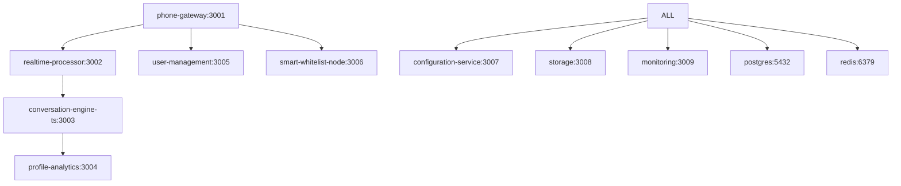

# 服务版本选择分析和建议

## 重复服务分析

### 1. Conversation Engine 服务

**可选版本:**
- `conversation-engine` (Python/FastAPI) - 功能最完整
- `conversation-engine-ts` (TypeScript/Express) - 轻量级实现  
- `conversation-engine-service` (TypeScript) - 基础版本

**推荐选择: conversation-engine-ts**
```
优势:
✅ TypeScript生态统一，便于团队开发
✅ 依赖Azure服务集成完善 (@azure/openai, @azure/cognitive-services-speech)
✅ 包含完整的意图识别和情感分析 (natural, sentiment)
✅ Express框架成熟稳定
✅ 测试覆盖率高

劣势:
❌ ML功能相比Python版本有限
❌ 缺少高级AI模型支持 (transformers, torch)
```

### 2. Smart Whitelist 服务

**可选版本:**
- `smart-whitelist` (Go) - 高性能实现
- `smart-whitelist-node` (TypeScript) - 功能丰富
- `smart-whitelist-service` (TypeScript) - 基础框架

**推荐选择: smart-whitelist-node**
```
优势:
✅ TypeScript生态统一
✅ 完整的ML集成 (机器学习分类器)
✅ Redis缓存优化
✅ 监控和指标集成 (prom-client)
✅ 安全特性完善 (helmet, bcrypt, rate-limiting)
✅ 数据库优化 (PostgreSQL)

劣势:
❌ 性能不如Go版本
❌ 内存占用相对较高
```

### 3. Profile Analytics 服务

**可选版本:**
- `profile-analytics` (Python) - ML功能强大
- `profile-analytics-service` (TypeScript) - 基础版本

**推荐选择: profile-analytics (Python)**
```
优势:
✅ 完整的ML pipeline (scikit-learn, transformers)
✅ 数据分析能力强 (pandas, numpy)
✅ Azure AI服务集成完善
✅ 实时数据处理能力
✅ 特征提取和模型训练完整

保留原因:
⚠️ ML和数据分析最适合Python生态
⚠️ 重写为TypeScript成本过高
```

## 最终服务架构选择

### 核心服务 (TypeScript为主)
1. **phone-gateway** (TypeScript) ✅ 已选择
2. **realtime-processor** (TypeScript) ✅ 已选择  
3. **conversation-engine-ts** (TypeScript) 🔄 新选择
4. **profile-analytics** (Python) ✅ 保持

### 支撑服务 (TypeScript统一)
5. **user-management** (TypeScript) ✅ 已选择
6. **smart-whitelist-node** (TypeScript) 🔄 新选择

### 平台服务 (TypeScript统一)
7. **configuration-service** (TypeScript) ✅ 已选择
8. **storage** (TypeScript) ✅ 已选择
9. **monitoring** (TypeScript) ✅ 已选择

## 服务依赖关系



## E2E测试优先级

### 第一优先级 (核心流程)
1. user-management (用户认证)
2. smart-whitelist-node (来电过滤)
3. phone-gateway (电话接入)

### 第二优先级 (AI功能)
4. realtime-processor (实时处理)
5. conversation-engine-ts (对话引擎)

### 第三优先级 (支撑功能)
6. profile-analytics (画像分析)
7. configuration-service (配置管理)
8. storage (存储服务)

## 实施建议

1. **优先启动基础服务**: PostgreSQL + Redis + user-management
2. **逐步添加核心服务**: smart-whitelist-node + phone-gateway
3. **最后集成AI服务**: realtime-processor + conversation-engine-ts
4. **使用Azure Mock服务**: 避免真实Azure API调用和费用